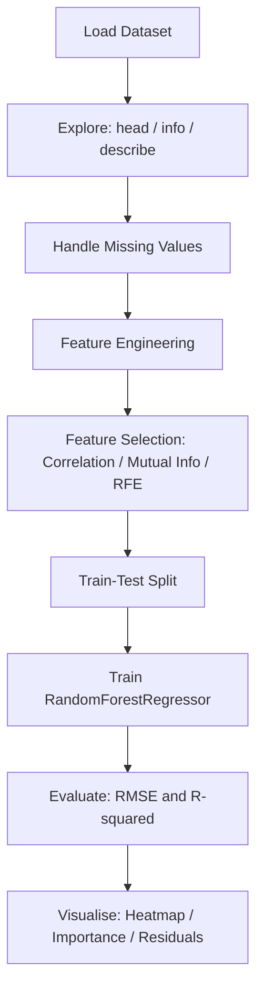
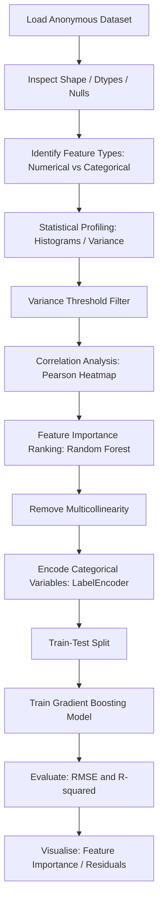
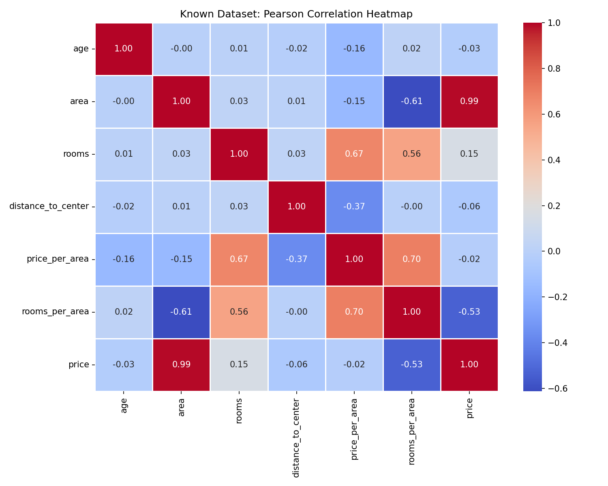
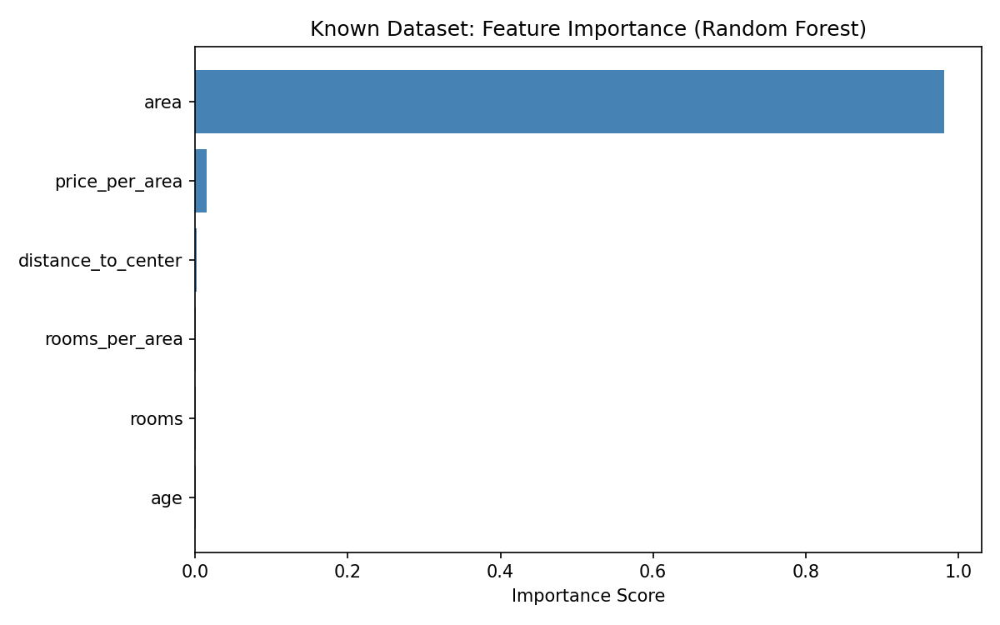
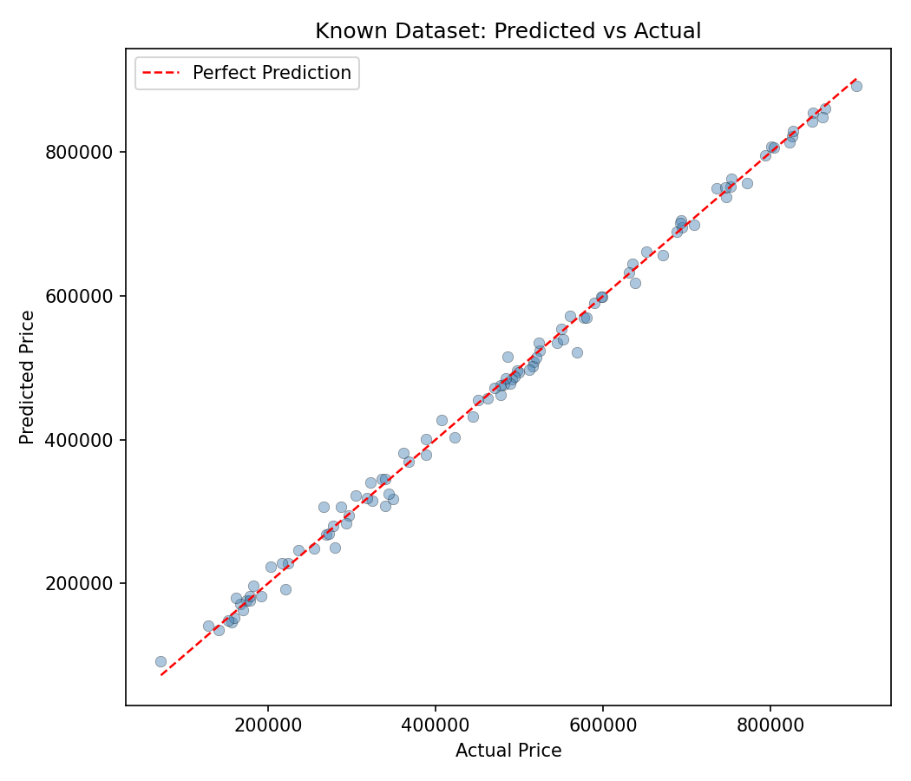
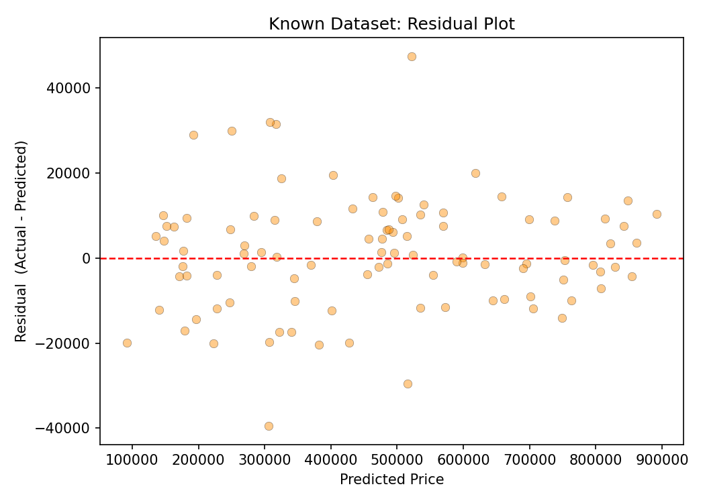
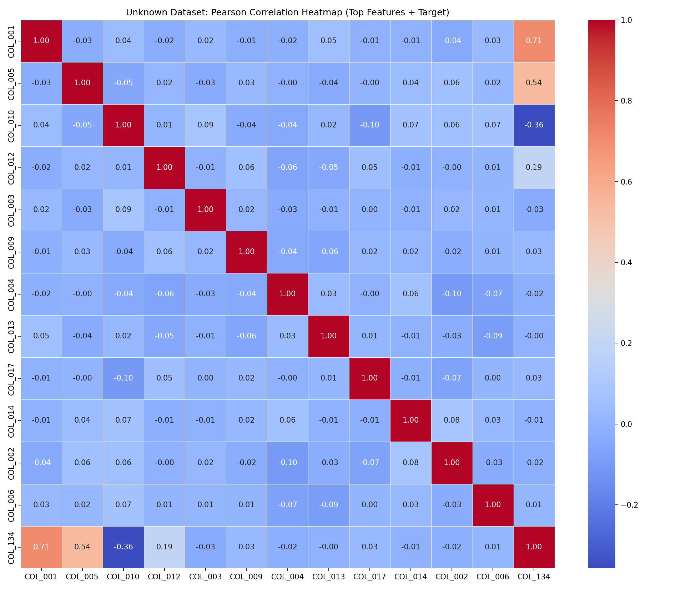
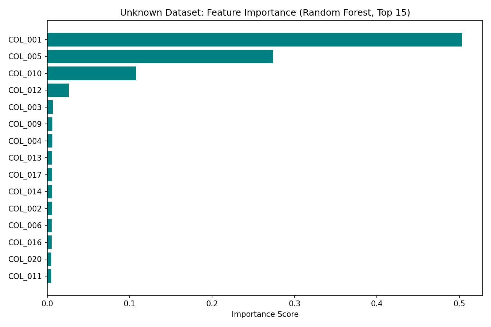
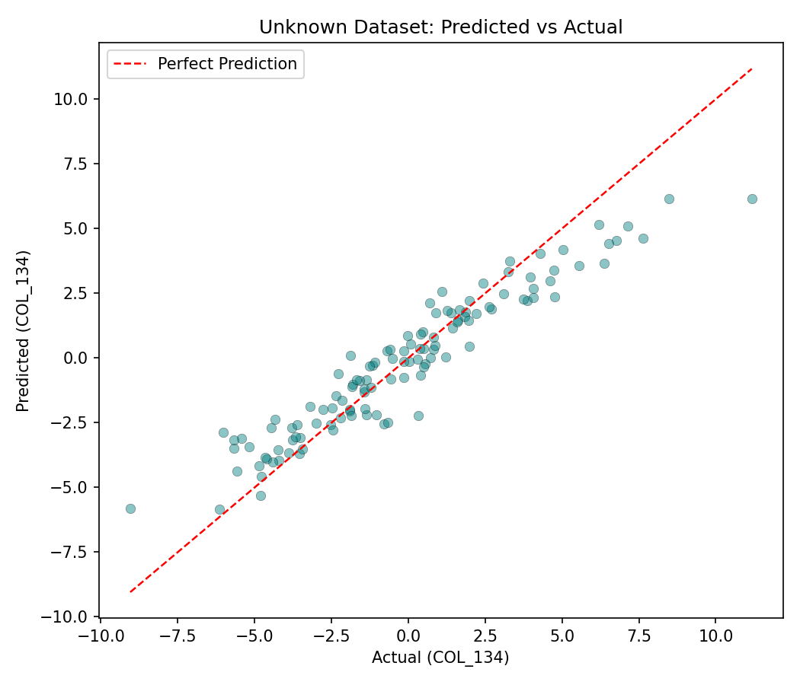
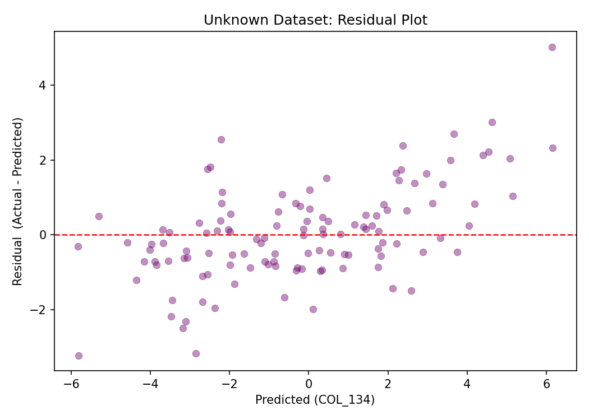

# Data Analysis: Known and Unknown Datasets

## Table of Contents

- [Overview](#overview)
- [Project Structure](#project-structure)
- [Known vs Unknown Datasets](#known-vs-unknown-datasets)
- [Reasoning: When a Dataset is Known or Unknown](#reasoning-when-a-dataset-is-known-or-unknown)
- [Machine Learning and EDA Vocabulary](#machine-learning-and-eda-vocabulary)
- [Workflow Diagrams](#workflow-diagrams)
  - [Known Dataset Workflow](#known-dataset-workflow)
  - [Unknown Dataset Workflow](#unknown-dataset-workflow)
- [Processing Known Datasets with Python](#processing-known-datasets-with-python)
- [Processing Unknown Datasets with Python](#processing-unknown-datasets-with-python)
- [Example: Real-World Unknown Dataset Workflow](#example-real-world-unknown-dataset-workflow)
- [Gradient Boosting for Unknown Datasets](#gradient-boosting-for-unknown-datasets)
- [Python Libraries](#python-libraries)
- [Key Plots](#key-plots)
- [Evaluation Metrics](#evaluation-metrics)
  - [Evaluating Known Labeled Datasets](#evaluating-known-labeled-datasets)
  - [Evaluating Unknown Unlabeled Datasets](#evaluating-unknown-unlabeled-datasets)
- [Environment Setup](#environment-setup)
- [Running the Scripts](#running-the-scripts)
- [References](#references)

---

## Overview

This project demonstrates machine learning workflows for two fundamentally different categories of datasets: **Known** and **Unknown**. A known dataset is one where the features, labels, and domain meanings are documented and understood. An unknown dataset contains anonymized, undocumented, or contextually ambiguous features that require statistical investigation before modeling can begin.

Both dataset types demand different analytical strategies, preprocessing pipelines, and feature selection approaches. This repository provides Python scripts, visualizations, and a structured guide for each workflow.

---

## Project Structure

```
Datasets/
▸ scripts/
  ◈ process_known_dataset.py
  ◈ process_unknown_dataset.py
▸ plots/
  ▪ known_correlation_heatmap.png
  ▪ known_feature_importance.png
  ▪ known_predicted_vs_actual.png
  ▪ known_residual_plot.png
  ▪ unknown_correlation_heatmap.png
  ▪ unknown_feature_importance.png
  ▪ unknown_predicted_vs_actual.png
  ▪ unknown_residual_plot.png
▪ README.md
▪ .gitignore
▪ requirements.txt
```

---

## Known vs Unknown Datasets

| Dataset Type    | Description                                                         |
| --------------- | ------------------------------------------------------------------- |
| Known Dataset   | Features, labels, and domain meanings are documented and understood |
| Unknown Dataset | Features are anonymized, undocumented, or lack domain context       |

### Examples

**Known dataset features:**

- `customer_age`
- `salary`
- `house_price`
- `sensor_temperature`

**Unknown dataset features:**

- `COL_001`
- `feature_42`
- encoded telemetry values
- anonymized industrial variables

---

## Reasoning: When a Dataset is Known or Unknown

A dataset is classified as **Known** when:

- Column names are self-descriptive and human-readable (e.g., `age`, `price`, `temperature`).
- Domain documentation exists, such as a data dictionary or schema definition.
- The target variable is labeled and its business meaning is clear.
- Feature engineering decisions can be guided by domain expertise.
- Business logic can validate whether a feature makes sense in context.

Known datasets rely on:

- domain expertise,
- business understanding.

A dataset is classified as **Unknown** when:

- Column names are anonymized, hashed, or numeric identifiers (e.g., `COL_001`, `feature_42`).
- No documentation or data dictionary is available.
- The origin of the data is uncertain (e.g., exported telemetry logs, third-party data providers).
- Feature semantics must be inferred entirely from statistical distributions.
- The relationship between features and the target is not intuitively understood.

Unknown datasets require:

- exploratory data analysis,
- automated feature selection,
- statistical profiling,
- machine learning algorithms.

---

## Machine Learning and EDA Vocabulary

| Term                              | Definition                                                                                                                                                                                                                         |
| --------------------------------- | ---------------------------------------------------------------------------------------------------------------------------------------------------------------------------------------------------------------------------------- |
| Residual Error Distribution       | The statistical distribution of differences between actual and predicted values. Ideally follows a normal distribution centered at zero, indicating no systematic bias in the model.                                                |
| Pearson Correlation               | A measure of the linear relationship between two continuous variables, ranging from -1 (perfect negative) to +1 (perfect positive). Computed as the covariance of two variables divided by the product of their standard deviations. |
| Variance Threshold                | A filter-based feature selection technique that removes features whose variance falls below a specified threshold. Useful for eliminating constant or near-constant columns that carry no predictive signal.                         |
| Lasso (L1 Regularization)         | A regression regularization method that adds the sum of absolute values of coefficients as a penalty term. Drives irrelevant feature coefficients to exactly zero, performing implicit feature selection.                            |
| Ridge Regression (L2 Regularization) | A regression regularization method that adds the sum of squared coefficients as a penalty. Shrinks all coefficients towards zero without eliminating them entirely, reducing model variance.                                      |
| Random Forest                     | An ensemble learning method that constructs multiple decision trees and aggregates their outputs. Provides feature importance scores based on the average reduction in impurity (Gini or entropy) across all trees.                  |
| Feature Selection                 | The process of identifying and retaining only the most relevant input variables for a predictive model, reducing dimensionality, improving generalization, and removing noise.                                                       |
| Multicollinearity                 | The condition where two or more predictor variables are highly correlated with each other, causing instability in regression coefficient estimates and making it difficult to isolate the effect of individual features.             |
| Regression                        | A supervised machine learning task that predicts a continuous target variable based on one or more input features. Examples include price prediction, temperature forecasting, and demand estimation.                                |
| RMSE (Root Mean Squared Error)    | A regression evaluation metric that measures the square root of the average squared differences between predicted and actual values. Penalizes large errors more heavily than Mean Absolute Error.                                  |
| ANOVA                             | Analysis of Variance. A statistical test that determines whether the means of two or more groups differ significantly. Frequently used in feature selection to assess the relationship between categorical variables and a continuous target. |
| Correlation Heatmaps              | A matrix visualization where each cell represents the Pearson correlation coefficient between two features. Color intensity encodes the strength and direction of the linear relationship between variable pairs.                    |

---

## Workflow Diagrams

### Known Dataset Workflow



### Unknown Dataset Workflow



---

## Processing Known Datasets with Python

### 1. Load Dataset

Using [pandas](https://pandas.pydata.org/):

```python
import pandas as pd

df = pd.read_csv("dataset.csv")
```

### 2. Explore Data

```python
print(df.head())
print(df.info())
print(df.describe())
```

### 3. Handle Missing Values

```python
df = df.fillna(df.mean())
```

### 4. Feature Engineering

Because the dataset is known:

- domain-specific transformations are possible,
- meaningful feature combinations can be created.

```python
df["price_per_area"] = df["price"] / df["area"]
```

### 5. Feature Selection

Algorithms:

- correlation analysis,
- mutual information,
- recursive feature elimination,
- tree-based importance.

### 6. Train Machine Learning Models

Using [scikit-learn](https://scikit-learn.org/stable/):

```python
from sklearn.ensemble import RandomForestRegressor

model = RandomForestRegressor()
model.fit(X_train, y_train)
```

Known datasets are easier because:

- feature meanings are understood,
- domain knowledge guides feature engineering,
- preprocessing decisions are clearer.

**Full classification example:**

```python
from sklearn.model_selection import train_test_split
from sklearn.ensemble import RandomForestClassifier
from sklearn.metrics import accuracy_score

# Assume 'X' is features and 'y' is the known target
X_train, X_test, y_train, y_test = train_test_split(X, y, test_size=0.2)

model = RandomForestClassifier()
model.fit(X_train, y_train)

predictions = model.predict(X_test)
print(accuracy_score(y_test, predictions))
```

---

## Processing Unknown Datasets with Python

Unknown datasets require:

- exploratory data analysis,
- statistical inspection,
- automated feature analysis.

### 1. Dataset Exploration

Start by inspecting shapes, datatypes, missing values, and distributions.

```python
print(df.shape)
print(df.dtypes)
print(df.isnull().sum())
```

### 2. Identify Feature Types

Detect numerical columns, categorical columns, sparse features, and constant variables.

```python
numeric_cols = df.select_dtypes(include=['number'])
```

### 3. Statistical Profiling

Important for unknown datasets. Use histograms, correlations, distributions, and variance analysis.

```python
corr = df.corr()
```

### 4. Feature Selection

Essential for unknown datasets because feature meanings are hidden and many variables may be irrelevant.

| Method                        | Purpose                       |
| ----------------------------- | ----------------------------- |
| Correlation                   | Detect linear relationships   |
| Mutual Information            | Detect nonlinear dependencies |
| Random Forest Importance      | Rank features                 |
| Recursive Feature Elimination | Reduce dimensionality         |

### 5. Handle Unknown Categorical Features

Unknown datasets often contain hashes, encoded IDs, and symbolic values.

Techniques:

- label encoding,
- one-hot encoding,
- CatBoost categorical handling.

```python
from sklearn.preprocessing import LabelEncoder

le = LabelEncoder()
df["col"] = le.fit_transform(df["col"].astype(str))
```

### 6. Train Regression or Classification Models

The choice of model type depends on the target variable.

**Regression algorithms** — used when target is continuous (e.g., house price prediction, sensor prediction, industrial forecasting):

- Linear Regression
- Random Forest Regression
- XGBoost
- LightGBM
- CatBoost

**Classification algorithms** — used when target is categorical (e.g., fraud detection, spam detection, equipment failure classification):

- Logistic Regression
- Random Forest
- XGBoost
- Support Vector Machines
- Neural Networks

---

## Example: Real-World Unknown Dataset Workflow

**Context:** Anonymized elevator telemetry dataset where the target variable is `COL_134`.

**Workflow:**

1. Explore columns
2. Remove sparse features
3. Encode categorical variables
4. Analyze correlations
5. Select important variables
6. Train regression models
7. Evaluate RMSE / R-squared
8. Interpret feature importance

### Feature Selection Workflow for Unknown Datasets

- **Clean Data:** Remove or handle missing values and scale numerical data using `RobustScaler` if outliers are present.
- **Run Correlation:** Quickly identify linear drivers using Pearson correlation.
- **Calculate Feature Importance:** Identify complex, non-linear drivers using tree-based models.
- **Visualize:** Create scatter plots or pairplots to confirm relationships for top-ranked features.
- **Remove Multicollinearity:** Ensure selected features are not highly correlated with each other using a correlation matrix to keep only independent predictors.

---

## Gradient Boosting for Unknown Datasets

Libraries such as XGBoost, LightGBM, and CatBoost are especially effective for unknown datasets because they:

- handle noisy data,
- support nonlinear relationships,
- rank feature importance,
- work well with tabular industrial datasets,
- tolerate missing values.

> **XGBoost** (short for "Extreme Gradient Boosting") is an open-source software library for efficient, scalable implementation of gradient boosting decision trees. It is widely used in machine learning and data science for its speed, accuracy, and flexibility, particularly in structured and tabular data competitions and production systems.

---

## Python Libraries

| Purpose             | Library                                                                          |
| ------------------- | -------------------------------------------------------------------------------- |
| Data analysis       | [pandas](https://pandas.pydata.org)                                              |
| Visualization       | [matplotlib](https://matplotlib.org)                                             |
| Machine learning    | [scikit-learn](https://scikit-learn.org)                                         |
| Gradient boosting   | [XGBoost](https://xgboost.ai)                                                    |
| Large datasets      | [PySpark](https://spark.apache.org/docs/latest/api/python/index.html)            |
| Experiment tracking | [MLflow](https://mlflow.org)                                                     |

---

## Key Plots

These plots are the most important because they connect the entire machine learning workflow:

| Plot Type           | Purpose                        |
| ------------------- | ------------------------------ |
| Feature Importance  | Identifies relevant variables  |
| Correlation Heatmap | Explores feature relationships |
| Predicted vs Actual | Evaluates regression accuracy  |
| Residual Plot       | Diagnoses model behavior       |

The scripts generate the following plots in the `plots/` directory.

---

### Known Dataset Plots

#### Correlation Heatmap

The Pearson correlation heatmap displays the linear relationship between every pair of features and the target variable `price`. Each cell contains a coefficient in the range -1 to +1: values near +1 indicate a strong positive relationship, values near -1 indicate a strong negative relationship, and values near 0 indicate no linear dependency. In a known dataset this view confirms which domain-understood features (e.g., `area`, `rooms`) are the strongest drivers of the target and immediately reveals multicollinearity between engineered columns such as `price_per_area`.



#### Feature Importance

The feature importance bar chart ranks input variables by their average reduction in impurity (Gini) across all decision trees in the Random Forest ensemble. A higher score means the feature contributes more to splitting decisions and therefore carries greater predictive signal. For a known dataset these scores can be cross-checked against domain knowledge: seeing `area` rank highest is consistent with the expectation that floor area is the primary price driver, providing a sanity check on the model.



#### Predicted vs Actual

The predicted vs actual scatter plot compares the model's output against the ground-truth labels on the held-out test set. Each point represents one observation. Points lying on or near the diagonal red dashed line (identity line) indicate accurate predictions. Systematic deviations above or below the line signal bias, while increasing spread at higher values suggests heteroscedasticity. A tight cluster along the diagonal, as expected for a known dataset with strong feature signals, confirms that the model has learned the underlying price structure.



#### Residual Plot

The residual plot shows the difference between actual and predicted values (residuals) on the vertical axis against the predicted values on the horizontal axis. A well-behaved regression model produces residuals that are randomly scattered around zero with no discernible pattern. Funnel shapes indicate heteroscedasticity, curved bands indicate non-linearity, and clusters suggest omitted variable bias. For a known dataset with high R², residuals should be uniformly distributed with no systematic structure, confirming the model assumptions are met.



---

### Unknown Dataset Plots

#### Correlation Heatmap

The Pearson correlation heatmap for the anonymous dataset reveals which of the `COL_XXX` features share linear dependencies with the target `COL_134` and with each other. Without domain context this view is the primary tool for identifying candidate predictors: columns with a high absolute correlation to the target are likely informative, while strongly correlated feature pairs flag multicollinearity that should be resolved before fitting a linear model. The heatmap is computed on the top features ranked by Random Forest importance to keep the matrix readable.



#### Feature Importance

The feature importance chart for the unknown dataset expresses the contribution of each anonymous `COL_XXX` variable to the Random Forest's predictive accuracy. Because no domain labels exist, this ranking substitutes for expert knowledge: the highest-scoring columns become the working definition of "relevant features" and guide further investigation. Columns with near-zero importance are candidates for removal, reducing dimensionality and training time without sacrificing predictive power.



#### Predicted vs Actual

The predicted vs actual scatter plot for the anonymous target `COL_134` evaluates whether the model has captured the underlying signal despite the absence of feature labels. Proximity to the identity line indicates successful regression even without domain understanding. Deviations from this line help quantify the RMSE reported in the evaluation step and guide decisions on whether to invest in additional feature engineering, model tuning, or data collection.



#### Residual Plot

The residual plot for the unknown dataset diagnoses the model's error structure across the predicted range of `COL_134`. Random scatter around zero confirms that the Random Forest has captured the majority of the signal present in the anonymous features. Any remaining pattern — such as a gradient or periodicity — would suggest that additional latent features exist in the dataset that have not been captured, prompting a further round of statistical profiling and feature extraction.



---

## Evaluation Metrics

Evaluating machine learning algorithms depends on whether the dataset is Known (labeled ground truth data used to verify performance) or Unknown (unlabeled data or data outside the training distribution).

### Evaluating Known Labeled Datasets

Known datasets use supervised metrics to compare model predictions against actual labels.

**Classification Metrics:**

| Metric    | Description                                                                                              |
| --------- | -------------------------------------------------------------------------------------------------------- |
| Accuracy  | Ratio of correct predictions to total observations                                                       |
| Precision | Accuracy of positive predictions: true positives divided by true positives plus false positives          |
| Recall    | Ability to find all positive instances: true positives divided by true positives plus false negatives     |
| F1-Score  | Harmonic mean of precision and recall, ideal for imbalanced datasets                                     |
| AUC-ROC   | Measures the model's ability to distinguish between classes across different decision thresholds          |

**Regression Metrics:**

| Metric    | Description                                                                                         |
| --------- | --------------------------------------------------------------------------------------------------- |
| MAE       | Mean Absolute Error: average of absolute differences between predicted and actual values            |
| RMSE      | Root Mean Squared Error: square root of the mean of squared residuals, penalizes large errors more  |
| R-squared | Proportion of variance in the target explained by the model; 1.0 is a perfect fit                  |

**Cross-Validation:**

Use K-Fold Cross-Validation to average performance across multiple subsets of data, reducing bias from a single train-test split.

### Evaluating Unknown Unlabeled Datasets

When labels are missing or data comes from a different distribution (Out-of-Distribution or OOD), standard supervised metrics cannot be applied directly.

**Clustering (Intrinsic) Metrics:**

| Metric               | Description                                                                                     |
| -------------------- | ----------------------------------------------------------------------------------------------- |
| Silhouette Index     | Measures how similar a data point is to its own cluster compared to other clusters              |
| Davies-Bouldin Index | Measures cluster compactness and separation; lower values indicate better-separated clusters    |

**Detection and Proxy Metrics:**

| Metric            | Description                                                                                              |
| ----------------- | -------------------------------------------------------------------------------------------------------- |
| Uncertainty Score | Output from Bayesian Neural Networks to identify OOD data points lacking model confidence               |
| Jaccard Score     | Measures similarity between two datasets to assess whether unknown data matches the training distribution |

See also: [Evaluating ML Models - AWS Documentation](https://docs.aws.amazon.com/machine-learning/latest/dg/evaluating_models.html)

---

## Environment Setup

### Prerequisites

- Python 3.9 or higher
- `pip` package manager

### Create and Activate Virtual Environment

**Linux / macOS:**

```bash
python3 -m venv venv
source venv/bin/activate
```

**Windows:**

```cmd
python -m venv venv
venv\Scripts\activate
```

### Install Dependencies

After activating the virtual environment:

```bash
pip install -r requirements.txt
```

### Verify Installation

```bash
python -c "import pandas, sklearn, matplotlib, seaborn, numpy; print('All libraries installed successfully')"
```

---

## Running the Scripts

Ensure the virtual environment is activated before running any commands.

**Step 1 — Activate virtual environment (Linux / macOS):**

```bash
source venv/bin/activate
```

**Step 2 — Run the known dataset script:**

```bash
python scripts/process_known_dataset.py
```

This generates:

- `plots/known_correlation_heatmap.png`
- `plots/known_feature_importance.png`
- `plots/known_predicted_vs_actual.png`
- `plots/known_residual_plot.png`

**Step 3 — Run the unknown dataset script:**

```bash
python scripts/process_unknown_dataset.py
```

This generates:

- `plots/unknown_correlation_heatmap.png`
- `plots/unknown_feature_importance.png`
- `plots/unknown_predicted_vs_actual.png`
- `plots/unknown_residual_plot.png`

All plots are saved automatically to the `plots/` directory relative to the working directory.

**Deactivate virtual environment when finished:**

```bash
deactivate
```

---

## References

- [pandas documentation](https://pandas.pydata.org/docs/)
- [scikit-learn documentation](https://scikit-learn.org/stable/)
- [scikit-learn feature selection guide](https://scikit-learn.org/stable/modules/feature_selection.html)
- [matplotlib documentation](https://matplotlib.org/stable/)
- [seaborn documentation](https://seaborn.pydata.org/)
- [XGBoost documentation](https://xgboost.readthedocs.io/en/stable/)
- [LightGBM documentation](https://lightgbm.readthedocs.io/en/stable/)
- [CatBoost documentation](https://catboost.ai/docs/)
- [MLflow documentation](https://mlflow.org/docs/latest/index.html)
- [Evaluating ML Models - AWS Machine Learning Developer Guide](https://docs.aws.amazon.com/machine-learning/latest/dg/evaluating_models.html)
- [Model evaluation, model selection, and algorithm selection in machine learning - Sebastian Raschka](https://sebastianraschka.com/blog/2016/model-evaluation-selection-part1.html)
