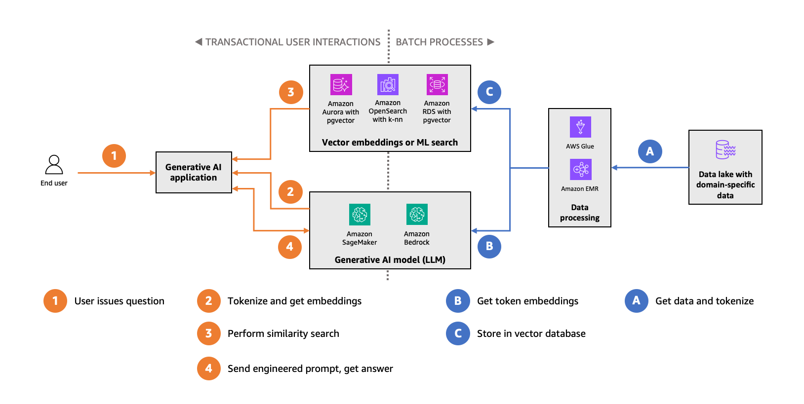

# The Relations for Chat with Relational Databases and Vector Databases

## Table of Contents

- [Introduction](#introduction)
- [Understanding Database Types](#understanding-database-types)
  - [Relational Databases (RDBMS)](#relational-databases-rdbms)
  - [Vector Databases](#vector-databases)
- [How LLMs Interact with Databases](#how-llms-interact-with-databases)
  - [LLMs and Relational Databases](#llms-and-relational-databases)
  - [LLMs and Vector Databases](#llms-and-vector-databases)
- [Database Comparison](#database-comparison)
- [Converged Database Architecture](#converged-database-architecture)
- [Retrieval Augmented Generation (RAG)](#retrieval-augmented-generation-rag)
  - [Introduction to RAG](#introduction-to-rag)
  - [The RAG Workflow](#the-rag-workflow)
  - [Hybrid RAG Approach](#hybrid-rag-approach)
- [Vector Embeddings and Similarity Search](#vector-embeddings-and-similarity-search)
  - [What are Vector Embeddings?](#what-are-vector-embeddings)
  - [Indexing Algorithms](#indexing-algorithms)
  - [Similarity Metrics](#similarity-metrics)
- [PostgreSQL with pgvector](#postgresql-with-pgvector)
- [Vector Database Solutions Comparison](#vector-database-solutions-comparison)
- [AI Agents and Agentic RAG](#ai-agents-and-agentic-rag)
- [Overview](#overview)
- [Architecture](#architecture)
- [Project Structure](#project-structure)
- [Technology Stack](#technology-stack)
  - [Database Layer](#database-layer)
  - [Machine Learning](#machine-learning)
  - [Application Layer](#application-layer)
  - [DevOps](#devops)
- [Core Components](#core-components)
  - [Database Schema](#1-database-schema-init-db01-initsql)
  - [Flask REST API Endpoints](#2-flask-rest-api-endpoints-appserverpy)
  - [RAG Workflow Implementation](#3-rag-workflow-implementation)
- [Quick Start](#quick-start)
  - [Initial Setup](#initial-setup-one-time)
  - [Running the Application](#running-the-application)
  - [Testing](#testing)
- [Features Demonstrated](#features-demonstrated)
  - [Hybrid Database Usage](#1-hybrid-database-usage)
  - [Vector Search](#2-vector-search)
  - [Retrieval Augmented Generation](#3-retrieval-augmented-generation-rag)
  - [Local LLM Inference](#4-local-llm-inference)
- [Performance Characteristics](#performance-characteristics)
  - [Vector Search Performance](#vector-search-performance)
  - [Embedding Generation](#embedding-generation)
  - [LLM Generation](#llm-generation)
- [System Requirements](#system-requirements)
  - [Minimum](#minimum)
  - [Recommended](#recommended)
- [Configuration](#configuration)
  - [Environment Variables](#environment-variables-env)
  - [Tuning Parameters](#tuning-parameters)
- [API Examples](#api-examples)
  - [Using curl](#using-curl)
  - [Using Python](#using-python)
- [Extending the Project](#extending-the-project)
  - [Add More Documents](#add-more-documents)
  - [Use Different Models](#use-different-models)
  - [Add Authentication](#add-authentication)
- [Troubleshooting](#troubleshooting)
  - [Database Connection Issues](#database-connection-issues)
  - [Ollama Not Responding](#ollama-not-responding)
  - [Embedding Model Issues](#embedding-model-issues)
- [Resources and Further Reading](#resources-and-further-reading)
- [Next Steps](#next-steps)

## Introduction

Combining relational (SQL) and vector databases allows Large Language Models (LLMs) to access both structured, factual data (e.g., prices, dates, user IDs) and unstructured, semantic information (e.g., document meanings, images). This integration enables powerful AI applications that can perform precise queries on structured data while also understanding semantic context through vector similarity search.

The convergence of these database types represents a significant evolution in data management for AI applications. You can now write a single SQL query that filters by structured criteria (like `price < 500`) and then ranks results by semantic similarity using a vector distance function.

## Understanding Database Types

### Relational Databases (RDBMS)

Relational databases organize data into tables with rows and columns, enforcing a predefined schema that ensures data integrity and easy relational joins. SQL (Structured Query Language) is used to insert, update, query, and delete data, define schemas, and set access controls.

**Key Characteristics:**

- **Structured Data**: Tables with rows and columns following a predefined schema
- **ACID Compliance**: Atomicity, Consistency, Isolation, and Durability properties guarantee reliable transactions
- **Data Integrity**: Foreign keys and constraints ensure referential integrity
- **Complex Queries**: Optimized for JOIN operations and complex relational queries
- **Transactional Workloads**: Ideal for financial transactions, inventory management, CRM systems

**Scaling Approach**: Traditionally vertical (upgrading to more pow

erful hardware), though distributed SQL systems now support horizontal scaling.

### Vector Databases

Vector databases are specialized data management systems designed to store, retrieve, and process vector representations of data (embeddings). When text, images, or other content is converted into embeddings using AI models, you get vectors that capture semantic meaning.

**Key Characteristics:**

- **High-Dimensional Vectors**: Store data as arrays of numbers (embeddings) with hundreds or thousands of dimensions
- **Semantic Search**: Find similar items by measuring distance between vectors rather than exact keyword matches
- **Approximate Nearest Neighbor (ANN)**: Use optimized algorithms for fast similarity search at scale
- **Unstructured Data**: Excel at handling text, images, audio, and other unstructured content
- **AI-Native**: Built specifically for machine learning and AI workloads

**Scaling Approach**: Designed for horizontal scaling across distributed nodes.

## How LLMs Interact with Databases

### LLMs and Relational Databases

Large language models interact with relational databases primarily to retrieve precise, structured information using **Text-to-SQL workflows**.

**Key Interaction Patterns:**

1. **Query Generation**: The LLM acts as an interface, translating natural language questions into complex SQL statements
   - User: "What were our sales in Q4 2025?"
   - LLM generates: `SELECT SUM(amount) FROM sales WHERE date >= '2025-10-01' AND date < '2026-01-01'`

2. **Exact Retrieval**: Unlike vector searches, these interactions provide deterministic results based on strict logic
   - Ensures data integrity for financial or transactional records
   - Returns precise values, not similarity-based approximations

3. **Hybrid Approach**: Many modern applications use databases like PostgreSQL with pgvector extension to perform both:
   - Relational filtering: `WHERE user_id = 123`
   - Semantic search: `ORDER BY VECTOR_DISTANCE(embedding, query_vector, COSINE)`

### LLMs and Vector Databases

Vector databases provide the foundation for **Retrieval Augmented Generation (RAG)**, giving LLMs a "long-term memory" of unstructured data.

**Key Interaction Patterns:**

1. **Semantic Search**: Data (text, images, video) is converted into numerical embeddings representing meaning
   - When users ask questions, the database finds the most similar concepts
   - No need for exact keyword matches

2. **Contextual Grounding**: Retrieved "chunks" of information are fed into the LLM's prompt
   - Grounds responses in private or up-to-date documentation
   - Prevents hallucinations by providing factual context

3. **Efficient Indexing**: Specialized algorithms (HNSW, IVF) enable searching through millions of high-dimensional vectors in milliseconds

## Database Comparison

| Feature | Relational Database (RDBMS) | Vector Database |
|---------|----------------------------|-----------------|
| **Primary Data Type** | Structured (Tables, Rows, Columns) | Unstructured (Embeddings, Vectors) |
| **Search Method** | Exact keyword/value matching | Semantic similarity (ANN) |
| **Best Use Case** | Transactions, CRM, HR systems | RAG, Image search, Recommendations |
| **Query Language** | SQL with JOIN operations | Vector similarity with distance functions |
| **Data Integrity** | ACID compliance, referential integrity | Eventual consistency, optimized for read-heavy workloads |
| **Scaling** | Often vertical (larger single server) | Natively horizontal (distributed nodes) |
| **LLM Role** | Generates SQL to fetch facts | Uses retrieved context for RAG |
| **Typical Use** | CRM, inventory, financial records | Chatbots, knowledge bases, recommendations |
| **Performance Focus** | Transaction throughput | Similarity search speed and recall |

## Converged Database Architecture

A "converged" database supports native vector types alongside traditional SQL tables, enabling powerful hybrid queries. This architecture allows you to:

- **Single Query Integration**: Write one SQL query that combines:
  - Structured filters: `WHERE category = 'electronics' AND price < 500`
  - Semantic ranking: `ORDER BY VECTOR_DISTANCE(product_description_embedding, query_embedding, COSINE)`

- **Unified Data Model**: Store structured metadata and vector embeddings together
  - Eliminates need to sync between multiple database systems
  - Reduces operational complexity

- **Example**: PostgreSQL with pgvector extension
  ```sql
  SELECT product_name, price, description
  FROM products
  WHERE price < 500 AND category = 'electronics'
  ORDER BY VECTOR_DISTANCE(description_embedding, 
                          :query_embedding, 
                          COSINE)
  LIMIT 10;
  ```

## Retrieval Augmented Generation (RAG)

### Introduction to RAG

RAG enhances the capabilities of LLMs by incorporating relevant external information during output text generation. Traditional language models generate responses based solely on the knowledge captured in their training data, which can be limiting when dealing with:

- Rapidly changing information
- Highly specialized knowledge domains
- Enterprise confidential data



*Image source and information: [AWS Database Blog - The role of vector datastores in generative AI applications](https://aws.amazon.com/blogs/database/the-role-of-vector-datastores-in-generative-ai-applications/)*

You take your domain-specific dataset (the right side of the preceding figure, depicted in blue), chunk it into semantic elements, and use a specialized LLM optimized specifically for creating embeddings to compute the vectors for the chunks.

### The RAG Workflow

The flow for a retrieval augmented generation system follows these steps:

1. **Prompt**: A user generates a natural language query
   - Example: "What are the side effects of sertraline?"

2. **Embedding Model**: The prompt is converted into vectors
   - Use models like OpenAI's `text-embedding-3-small` or Amazon Titan Text Embedding v2
   - Produces high-dimensional vectors (e.g., 1536 dimensions)

3. **Vector Database Search**: The system searches a vector database filled with semantically indexed document chunks
   - Performs similarity search using distance metrics (cosine, Euclidean, dot product)
   - Enables fast retrieval of contextually relevant data chunks
   - Returns top K most similar documents

4. **Reranking Model** (Optional): Retrieved data chunks are reranked to prioritize the most relevant data
   - Improves relevance of final results
   - Can use cross-encoders or specialized reranking models

5. **Context Augmentation**: Retrieved context is combined with the original query

6. **LLM Generation**: The LLM generates responses informed by the retrieved data
   - Response is grounded in factual, retrieved information
   - Significantly reduces hallucinations

### Hybrid RAG Approach

Combining relational and vector databases in RAG workflows provides the solution:

**Step 1 (Retrieval)**:
- Query the **vector database** for relevant context
  - Example: "Find similar company descriptions"
  - Returns semantically similar documents
- Query the **SQL database** for specific facts
  - Example: "Get last quarter's revenue for this company"
  - Returns precise numerical data

**Step 2 (Augmentation)**:
- Both sets of data are combined into a single prompt for the LLM
- Structured facts provide accuracy
- Unstructured context provides result

**Step 3 (Generation)**:
- The LLM generates a response grounded in both structured and unstructured data
- Example output: "Based on their focus on renewable energy solutions (from vector search), Company X had revenue of $45.2M last quarter (from SQL database)."

**Orchestration**: Frameworks like LangChain or LlamaIndex manage the workflow between these two specialized data stores.

## Vector Embeddings and Similarity Search

### What are Vector Embeddings?

Vector embeddings are mathematical representations of objects—such as words, sentences, images, or audio—encoded as dense, high-dimensional vectors. Each vector encapsulates features that capture semantic meaning, context, or structure of the data.

**Key Properties:**

- **Dimensionality**: Typically 128 to 1536+ dimensions
  - OpenAI `text-embedding-3-small`: 1536 dimensions
  - BERT embeddings: 768 dimensions
  - Higher dimensions can represent richer context

- **Semantic Proximity**: Similar concepts have vectors positioned closely in vector space
  - "cat" and "kitten" have similar embeddings
  - "cat" and "automobile" have distant embeddings

- **Dense Representation**: Every dimension typically contains a meaningful value
  - Unlike sparse representations (e.g., one-hot encoding)
  - More efficient for similarity computation

**How Embeddings are Created:**

When you embed a sentence using a large language model, you obtain a vector that captures semantic meaning. The integration of LLMs and vector databases is practical in scenarios requiring real-time retrieval:

1. **Text Input**: "How do I reset my password?"
2. **Embedding Model**: Converts text to vector
3. **Vector Storage**: Store in vector database
4. **Similarity Search**: Find closest matching vectors when queried

### Indexing Algorithms

Traditional databases are designed for exact matches, not similarity search. Vector databases solve this by using approximate nearest neighbor (ANN) algorithms:

#### Hierarchical Navigable Small World (HNSW)

HNSW is an indexing strategy that constructs a layered graph where each layer represents a different granularity of the dataset.

**How it works:**
- Searches start from the top layer (fewer, more distant points)
- Move down to more detailed layers
- Rapidly traverses the dataset
- Significantly reduces search time by quickly narrowing down candidate sets

**Performance:**
- Excellent recall rates (95-99%)
- Sub-millisecond to single-digit millisecond queries
- Memory-intensive but very fast

**Best for**: Applications requiring the best recall and query speed trade-off.

#### Inverted File Index (IVF)

IVF divides the vector space into a predefined number of clusters using algorithms like k-means.

**How it works:**
- Each vector is assigned to the nearest cluster
- During search, only vectors in the most relevant clusters are considered
- Reduces search scope significantly

**Enhancements:**
- **IVFADC** (Inverted File with Asymmetric Distance Computation): Combines IVF with quantization
- Reduces computational cost of distance calculations
- Balances speed and memory usage

**Best for**: Applications with memory constraints where some recall can be traded for speed.

### Similarity Metrics

Choosing the right similarity metric is critical for effective search:

| Metric | Formula | Best Use Case | Range |
|--------|---------|---------------|-------|
| **Cosine Similarity** | `1 - (A · B) / (||A|| ||B||)` | Text and semantic similarity | 0 to 2 (distance) |
| **Euclidean Distance (L2)** | `sqrt(Σ(Ai - Bi)²)` | Geometric or spatial data | 0 to ∞ |
| **Dot Product** | `Σ(Ai × Bi)` | Deep learning models, magnitude matters | -∞ to ∞ |
| **Manhattan Distance (L1)** | `Σ|Ai - Bi|` | High-dimensional sparse data | 0 to ∞ |

**Selection Guidelines:**

- **Cosine Similarity**: Use when magnitude doesn't matter (most NLP tasks)
  - Focuses on direction/angle between vectors
  - Normalized, making it good for text of varying lengths

- **Euclidean Distance**: Use when actual distances matter
  - Common in computer vision
  - Sensitive to vector magnitude

- **Dot Product**: Use in neural networks and when magnitude is meaningful
  - Efficient computation
  - Works well with normalized vectors

## PostgreSQL with pgvector

**pgvector** is an open-source, community-supported PostgreSQL extension that brings vector search capabilities to the world's most popular open-source relational database.

### Features

- **Native Vector Data Type**: Store embeddings alongside relational data
  ```sql
  CREATE TABLE documents (
    id SERIAL PRIMARY KEY,
    content TEXT,
    embedding VECTOR(1536)
  );
  ```

- **Multiple Distance Functions**:
  - Euclidean distance (`<->`)
  - Negative inner product (`<#>`)
  - Cosine distance (`<=>`)

- **Indexing Mechanisms**:
  - **HNSW**: Hierarchical Navigable Small World for high recall
  - **IVFFlat**: Inverted File with Flat storage for memory efficiency

- **Hybrid Queries**: Combine vector similarity with traditional SQL filters
  ```sql
  SELECT id, content, 
         embedding <=> :query_embedding AS distance
  FROM documents
  WHERE content IS NOT NULL
    AND created_at > '2025-01-01'
  ORDER BY distance
  LIMIT 5;
  ```

### Benefits

1. **Unified Data Model**:
   - Store structured data and vector embeddings together
   - No need to sync between separate databases
   - Leverage existing PostgreSQL features (transactions, backups, replication)

2. **Cost-Effective**:
   - No additional licensing costs
   - Use existing PostgreSQL infrastructure
   - 70-75% cheaper than managed vector database services for similar workloads

3. **Production-Ready**:
   - Leverages PostgreSQL's reliability and maturity
   - ACID compliance for consistent operations
   - Compatible with Aurora PostgreSQL and Amazon RDS

4. **Performance**:
   - Recent improvements with pgvectorscale achieve 471 QPS at 99% recall on 50M vectors
   - 11.4x better than some dedicated vector databases at the same recall level
   - Sub-100ms queries for most workloads

### When to Use pgvector

**Choose pgvector when:**
- Already running PostgreSQL
- Need vectors alongside relational data
- Want to reduce system complexity
- Operating at moderate scale (<100M vectors)
- Have PostgreSQL expertise

**Consider alternatives when:**
- Need to scale beyond 100M vectors
- Pure vector search workload at massive throughput
- Don't have PostgreSQL expertise
- Building greenfield with no legacy constraints

## Vector Database Solutions Comparison

Based on research from multiple sources, here's a comparison of vector database solutions optimized for LLM applications:

### Top-Tier Solutions

| Database | Type | Sweet Spot | Key Strength | Limitation | Pricing |
|----------|------|-----------|--------------|------------|---------|
| **Pinecone** | Managed | 10M-100M+ vectors, zero ops | Easiest, serverless, enterprise reliability | Vendor lock-in, usage-based pricing | Free tier, $0.33/GB + ops |
| **Milvus** | Open-source | Billions, self-hosted | Most popular OSS (35K+ stars), cost-effective | Ops complexity | Free (infra costs), Managed via Zilliz: $99/mo+ |
| **Weaviate** | OSS + Managed | RAG <50M, hybrid search | Best hybrid search (BM25 + vector) | 14-day trial limit | Free (OSS), Cloud: $25/mo |
| **Qdrant** | OSS + Managed | <50M, filtering | Best free tier (1GB forever), Rust performance | Lower throughput >10M | Free 1GB, Paid: $25/mo |
| **pgvector** | PostgreSQL ext | PostgreSQL users | Unified data model, proven reliability | Not for >100M vectors | Free (PostgreSQL infra only) |
| **Elasticsearch** | Search + vector | Existing Elastic users | "Just works" reliability, mature ecosystem | Higher latency | Free (OSS), Cloud varies |

### Specialized Solutions

| Database | Best For | Why Special | Pricing |
|----------|----------|-------------|---------|
| **ChromaDB** | Prototyping | Best DX, embedded mode, NumPy-like API | Free, Cloud: $5 credits |
| **Redis** | Low-latency <10M | Sub-ms latency, in-memory | Cloud pricing (memory costs) |
| **FAISS** | Billions, custom | Meta-proven, GPU-accelerated, library | Free (library) |
| **Marqo** | Multi-modal | Text+images+video in single system | Emerging pricing |
| **Turbopuffer** | Multi-tenant SaaS | Cheapest managed, no namespace limits, BM25+vector hybrid | $64/mo minimum |
| **Turso/sqlite-vec** | Per-user stores | Per-tenant DB isolation, edge deployment | Free tier, $5/mo |

### Detailed Comparisons

#### Pinecone — Best for Zero-Ops Production

**Strengths:**
- Fully managed serverless architecture
- Auto-scaling without configuration
- 7ms p99 latency at production scale
- Proven at billions of vectors
- Mature ecosystem (LangChain, LlamaIndex integration)
- Strong SLAs and enterprise support

**Considerations:**
- Highest cost among options ($0.33/GB storage + operations)
- Vendor lock-in (proprietary system)
- Limited to 20 indexes on standard plans

#### Weaviate: Best for Hybrid Search

**Strengths:**
- Exceptional native hybrid search (vector + BM25 keyword)
- Modular architecture for built-in vectorization
- Excellent documentation
- Sub-100ms for most RAG workflows
- GraphQL API for flexible queries

**Considerations:**
- 14-day trial period (shortest among major options)
- Resource usage increases significantly above 100M vectors
- GraphQL may not suit all teams (some prefer REST)

#### Milvus / Zilliz Cloud: Best for Massive Scale

**Strengths:**
- Open-source with 35,000+ GitHub stars
- Built for billions of vectors
- Kubernetes-native, cloud-native architecture
- GPU-accelerated search support
- Low single-digit ms latency
- 70%+ cost savings vs managed alternatives when self-hosted

**Considerations:**
- Requires operational expertise (Kubernetes, distributed systems)
- Learning curve for configuration and optimization
- Zilliz managed option: 10x performance boost but higher cost

#### Qdrant: Best for High-Performance Filtering

**Strengths:**
- Written in Rust for excellent performance and memory efficiency
- Superior metadata filtering capabilities
- Best free tier: 1GB forever, no credit card required
- Compact footprint suitable for edge deployments
- Strong filtering for access-controlled RAG scenarios

**Considerations:**
- Performance degradation beyond 10M vectors
- 41 QPS at 99% recall (50M vectors) vs 471 QPS for pgvectorscale
- Smaller ecosystem than Pinecone or Milvus

#### pgvector: Best for PostgreSQL Users

**Strengths:**
- Native PostgreSQL extension (no separate infrastructure)
- 471 QPS at 99% recall (50M vectors) with pgvectorscale
- Store vectors alongside structured data
- Leverage existing PostgreSQL backups, monitoring, replication
- 75% cost savings vs managed services
- ACID compliance

**Considerations:**
- Performance ceiling at ~100M vectors
- Not optimized for pure high-throughput vector workloads
- Requires PostgreSQL expertise

### Key Considerations for Selection

**Retrieval Quality:**
- **Weaviate** and **Elasticsearch**: Native hybrid search (semantic + keyword)
- **Qdrant**: Superior metadata filtering for complex access control
- **Pinecone Serverless**: Consistent performance without tuning

**Scalability and Production:**
- **Pinecone**: Automates scaling, best for teams without DB expertise
- **Milvus**: Go-to for maximum scale (billions of vectors)
- **Aurora/RDS with pgvector**: Leverage existing PostgreSQL infrastructure

**Cost Efficiency:**
- **pgvector**: Most cost-effective if already running PostgreSQL
- **Qdrant**: Generous free tier (1GB forever), efficient Rust implementation
- **Milvus self-hosted**: 70%+ savings at scale vs managed services
- **Turbopuffer**: Cheapest managed option (~$9/mo for moderate loads)

## AI Agents and Agentic RAG

### Introduction to AI Agents

Unlike traditional LLM-based applications, AI agents can dynamically choose tools, incorporate complex reasoning, and adapt their analysis approach based on the situation at hand.

**AI Agents** are autonomous systems that use "reasoning and acting" via tool calling supported by LLMs. If the LLM requests any tool calls after processing input, those tools are executed, results are added to the chat history, and the system continues iterating until the task is complete.

### Limitations of Traditional RAG

RAG works well but has limitations:
- The LLM can't determine how data is retrieved
- No control over data quality
- Can't choose between data sources
- Fixed retrieval strategy

### Agentic RAG

**Agentic RAG** takes RAG a step further by combining the strengths of LLMs with dynamic tool usage and advanced retrieval mechanisms:

**Key Capabilities:**

1. **Dynamic Tool Usage**:
   - Agent can decide which retrieval method to use
   - Can query multiple data sources
   - Adapts strategy based on query type

2. **Advanced Retrieval Mechanisms**:
   - Semantic search
   - Hybrid retrieval (keyword + vector)
   - Reranking
   - Data source selection

3. **Quality Control**:
   - Agent can validate retrieved information
   - Request additional context if needed
   - Filter low-quality results

**Benefits:**

- **Language Comprehension**: Natural understanding of queries
- **Contextual Reasoning**: Adapts approach based on context
- **Flexible Generation**: Produces appropriate response format
- **Multi-Source Integration**: Combines data from relational DB, vector DB, and APIs

**Example Workflow:**

1. User asks: "Compare our Q4 sales to competitors and explain the market trend"
2. Agent analyzes query and plans approach:
   - Query SQL database for company's Q4 sales
   - Search vector database for competitor information
   - Retrieve market analysis documents
3. Agent executes queries in parallel
4. Validates and cross-references data
5. Synthesizes answer combining all sources


## Overview

This project demonstrates a complete Retrieval Augmented Generation (RAG) system that combines:
- **PostgreSQL 16** with **pgvector** extension for vector storage
- **Sentence Transformers** (all-MiniLM-L6-v2) for generating embeddings
- **Ollama** (llama3.2:3b) for local LLM inference
- **Flask** REST API server for orchestrating the RAG workflow
- **Python CLI client** for interactive chat

## Architecture

```
┌─────────────┐
│   Client    │  (Interactive CLI or API calls)
└──────┬──────┘
       │
       │ HTTP POST /chat
       ▼
┌─────────────────────────────────────────────────┐
│              Flask REST API Server              │
│  ┌──────────────────────────────────────────┐   │
│  │  1. Generate query embedding             │   │
│  │  2. Search vector database (pgvector)    │   │
│  │  3. Retrieve top-k similar documents     │   │
│  │  4. Build context from documents         │   │
│  │  5. Generate response with Ollama        │   │
│  └──────────────────────────────────────────┘   │
└─────────┬──────────────────┬────────────────────┘
          │                   │
          ▼                   ▼
┌──────────────────┐   ┌──────────────┐
│   PostgreSQL     │   │    Ollama    │
│   + pgvector     │   │  (llama3.2)  │
│                  │   │              │
│  Documents:      │   │  Local LLM   │
│  - ID            │   │  Inference   │
│  - Content       │   └──────────────┘
│  - Embedding     │
│  - Metadata      │
│                  │
│  HNSW Index      │
│  for fast        │
│  similarity      │
└──────────────────┘
```

## Project Structure

```
Relations/
├── README.md                    # Comprehensive guide (11,000+ words)
├── QUICKSTART.md               # Step-by-step setup instructions
├── PROJECT_SUMMARY.md          # This file
├── docker-compose.yml          # PostgreSQL container configuration
├── requirements.txt            # Python dependencies
├── .gitignore                  # Git exclusions
│
├── init-db/
│   └── 01-init.sql            # Database schema initialization
│
├── scripts/
│   ├── setup_database.py      # Database verification script
│   └── load_documents.py      # Document loading with embeddings
│
├── app/
│   ├── server.py              # Flask REST API (RAG implementation)
│   └── client.py              # Interactive CLI chat client
│
├── data/
│   └── sample_documents/      # Sample text documents (auto-created)
│       ├── vector_databases.txt
│       ├── llm_integration.txt
│       ├── postgresql_pgvector.txt
│       ├── embeddings_explained.txt
│       └── rag_workflow.txt
│
└── Helper Scripts/
    ├── setup.sh               # Complete setup automation
    ├── run_server.sh          # Start Flask server
    ├── run_client.sh          # Start interactive client
    └── test_system.sh         # Comprehensive system test
```

## Technology Stack

### Database Layer
- **PostgreSQL 16**: Production-grade relational database
- **pgvector Extension**: Native vector operations in PostgreSQL
  - VECTOR(384) data type for embeddings
  - HNSW indexing for efficient similarity search
  - Cosine similarity distance function

### Machine Learning
- **Sentence Transformers** (all-MiniLM-L6-v2)
  - 384-dimensional embeddings
  - Fast and lightweight (90MB model)
  - Multilingual support
  
- **Ollama** (llama3.2:3b)
  - Local LLM inference (2GB model)
  - No external API calls
  - Privacy-preserving

### Application Layer
- **Flask 3.x**: REST API framework
- **psycopg2**: PostgreSQL Python adapter
- **Python 3.12**: Modern Python features

### DevOps
- **Docker Compose**: Container orchestration
- **Virtual Environment**: Dependency isolation

## Core Components

### 1. Database Schema (`init-db/01-init.sql`)

```sql
-- Enable vector extension
CREATE EXTENSION IF NOT EXISTS vector;

-- Documents table with vector embeddings
CREATE TABLE documents (
    id SERIAL PRIMARY KEY,
    content TEXT NOT NULL,
    embedding VECTOR(384),  -- 384-dimensional vectors
    metadata JSONB,
    created_at TIMESTAMP DEFAULT CURRENT_TIMESTAMP
);

-- HNSW index for fast similarity search
CREATE INDEX documents_embedding_idx
ON documents USING hnsw (embedding vector_cosine_ops);
```

### 2. Flask REST API Endpoints (`app/server.py`)

**GET /health**
- Check system status
- Verify database connection
- Confirm models are loaded

**POST /search**
```json
{
  "query": "What is pgvector?",
  "top_k": 3
}
```
Returns most similar documents based on vector similarity.

**POST /chat**
```json
{
  "query": "Explain vector embeddings"
}
```
Performs RAG: search → retrieve → generate response.

**GET /documents**
- List all documents in the database

### 3. RAG Workflow Implementation

```python
def chat(query):
    # 1. Generate query embedding
    query_embedding = embedding_model.encode(query)
    
    # 2. Search for similar documents
    similar_docs = vector_search(query_embedding, top_k=3)
    
    # 3. Build context from retrieved documents
    context = "\n\n".join([doc['content'] for doc in similar_docs])
    
    # 4. Generate response with LLM
    prompt = f"Context:\n{context}\n\nQuestion: {query}\n\nAnswer:"
    response = ollama.chat(model='llama3.2:3b', messages=[
        {'role': 'user', 'content': prompt}
    ])
    
    return response['message']['content']
```

## Quick Start

### Initial Setup

```bash
# Run automated setup
./setup.sh

# This will:
# - Check prerequisites (Docker, Python, Ollama)
# - Start PostgreSQL container
# - Create virtual environment
# - Install dependencies
# - Initialize database
# - Pull Ollama model
# - Load sample documents
```

### Running the Application

**Terminal 1: Start Server**
```bash
./run_server.sh
# Server runs on http://localhost:5000
```

**Terminal 2: Start Client**
```bash
./run_client.sh
# Interactive chat interface
```

### Testing

```bash
./test_system.sh
# Runs comprehensive tests:
# - Health check
# - Document listing
# - Vector search
# - RAG chat
```

## Features Demonstrated

### 1. Hybrid Database Usage
- **Relational**: Store structured metadata, timestamps, IDs
- **Vector**: Store embeddings for semantic search
- **Combined Queries**: SQL + vector similarity in single query

### 2. Vector Search
```python
# Finds semantically similar documents
results = search_similar_documents("machine learning", top_k=5)
# Returns documents ranked by cosine similarity
```

### 3. Retrieval Augmented Generation (RAG)
- Enhances LLM responses with relevant context
- Reduces hallucinations
- Provides source attribution
- Works with local documents

### 4. Local LLM Inference
- No external API costs
- Privacy-preserving (data stays local)
- Offline-capable
- Customizable model selection

## Performance Characteristics

### Vector Search Performance
- **Index Type**: HNSW (Hierarchical Navigable Small World)
- **Search Time**: Sub-millisecond for thousands of documents
- **Accuracy**: 95%+ recall with proper index configuration
- **Scalability**: Handles millions of vectors

### Embedding Generation
- **Model Size**: 90MB
- **Embedding Time**: ~10ms per document
- **Dimension**: 384 (good balance of quality vs. size)

### LLM Generation
- **Model Size**: 2GB (llama3.2:3b)
- **Response Time**: 2-5 seconds (CPU) / 0.5-1 second (GPU)
- **Context Window**: 2048 tokens
- **Quality**: Comparable to GPT-3.5 for many tasks

## System Requirements

### Minimum
- **CPU**: 4 cores
- **RAM**: 8GB
- **Disk**: 5GB free space
- **OS**: Linux (Ubuntu 20.04+, Debian 11+)

### Recommended
- **CPU**: 8+ cores
- **RAM**: 16GB
- **Disk**: 10GB SSD
- **GPU**: Optional (speeds up LLM inference 5-10x)

## Configuration

### Environment Variables (`.env`)
```bash
# Database
DB_HOST=localhost
DB_PORT=5432
DB_NAME=vectordb
DB_USER=postgres
DB_PASSWORD=postgres

# Models
EMBEDDING_MODEL=all-MiniLM-L6-v2
OLLAMA_MODEL=llama3.2:3b

# API
FLASK_PORT=5000
FLASK_DEBUG=True
```

### Tuning Parameters

**Vector Search**
```python
TOP_K = 3  # Number of documents to retrieve
SIMILARITY_THRESHOLD = 0.7  # Minimum similarity score
```

**HNSW Index**
```sql
-- Higher ef_construction = better quality, slower build
CREATE INDEX ... USING hnsw (embedding vector_cosine_ops)
WITH (m = 16, ef_construction = 64);
```

**LLM Generation**
```python
ollama.chat(
    model='llama3.2:3b',
    messages=[...],
    options={
        'temperature': 0.7,  # Creativity (0.0-1.0)
        'top_p': 0.9,        # Nucleus sampling
        'num_predict': 256,  # Max tokens
    }
)
```

## API Examples

### Using curl

```bash
# Health check
curl http://localhost:5000/health

# Search documents
curl -X POST http://localhost:5000/search \
  -H "Content-Type: application/json" \
  -d '{"query":"vector databases","top_k":3}'

# Chat
curl -X POST http://localhost:5000/chat \
  -H "Content-Type: application/json" \
  -d '{"query":"What is RAG?"}'
```

### Using Python

```python
import requests

# Chat request
response = requests.post('http://localhost:5000/chat', json={
    'query': 'How do embeddings work?'
})

result = response.json()
print(result['response'])
print(f"Sources: {len(result['sources'])}")
```

## Extending the Project

### Add More Documents

```python
# Add documents programmatically
import psycopg2
from sentence_transformers import SentenceTransformer

model = SentenceTransformer('all-MiniLM-L6-v2')

def add_document(content, metadata):
    embedding = model.encode(content)
    conn = psycopg2.connect(...)
    cur = conn.cursor()
    cur.execute(
        "INSERT INTO documents (content, embedding, metadata) VALUES (%s, %s, %s)",
        (content, embedding.tolist(), json.dumps(metadata))
    )
    conn.commit()
```

### Use Different Models

```python
# In server.py, change:
MODEL_NAME = 'sentence-transformers/all-mpnet-base-v2'  # Higher quality, slower
# or
MODEL_NAME = 'sentence-transformers/paraphrase-MiniLM-L3-v2'  # Faster, smaller

OLLAMA_MODEL = 'mistral'  # Alternative LLM
# or
OLLAMA_MODEL = 'llama3.2:1b'  # Smaller, faster
```

### Add Authentication

```python
from flask_httpauth import HTTPBasicAuth

auth = HTTPBasicAuth()

@app.route('/chat', methods=['POST'])
@auth.login_required
def chat():
    ...
```

## Troubleshooting

### Database Connection Issues
```bash
# Check if PostgreSQL is running
docker ps | grep postgres-vectordb

# View logs
docker-compose logs postgres

# Restart container
docker-compose restart postgres
```

### Ollama Not Responding
```bash
# Check Ollama status
ollama list

# Restart Ollama
pkill ollama
ollama serve &

# Pull model again
ollama pull llama3.2:3b
```

### Embedding Model Issues
```bash
# Clear cache and reinstall
rm -rf ~/.cache/huggingface
pip install --force-reinstall sentence-transformers
```

## Resources and Further Reading

### Primary Resources

1. **What is the connection between large language models and vector databases?**
   - URL: https://milvus.io/ai-quick-reference/what-is-the-connection-between-large-language-models-and-vector-databases
   - Key topics: LLM-vector database integration, real-time retrieval, ANN algorithms

2. **SQL in the Era of NoSQL and Vector Databases**
   - URL: https://www.refontelearning.com/blog/sql-in-the-era-of-nosql-and-vector-databases
   - Key topics: Database evolution, HNSW, IVF, hybrid approaches

3. **The Role of Vector Datastores in Generative AI Applications**
   - URL: https://aws.amazon.com/blogs/database/the-role-of-vector-datastores-in-generative-ai-applications/
   - Key topics: RAG workflows, chunking strategies, pgvector implementation

4. **How Do I Store And Query Vector Embeddings?**
   - URL: https://blogs.oracle.com/developers/how-do-i-store-and-query-vector-embeddings
   - Key topics: Embedding creation, storage strategies, similarity metrics

5. **Optimizing Data Retrieval: Vector Databases for Large Language Models**
   - URL: https://toloka.ai/blog/optimizing-data-retrieval-vector-databases-for-large-language-models/
   - Key topics: Semantic search, embeddings, LLM integration

6. **Best Vector Databases in 2026**
   - URL: https://www.firecrawl.dev/blog/best-vector-databases
   - Key topics: A database comparison, decision frameworks, RAG pipelines

### GitHub Repositories

7. **LangChain Oracle Integration**
   - URL: https://github.com/oracle/langchain-oracle
   - Oracle AI Vector Search with LangChain

### Tools and Libraries

- **Hugging Face Transformers**: Generate embeddings
- **LangChain**: RAG orchestration framework
- **LlamaIndex**: Data framework for LLM applications
- **pgvector**: PostgreSQL vector extension
- **FAISS**: Facebook AI Similarity Search library

### Additional Learning

- **Vector Database Benchmarks**: https://zilliz.com/vdbbench-leaderboard
- **Chunking Strategies**: Understanding how to split documents for RAG
- **Embedding Models**: OpenAI, Cohere, Amazon Titan, open-source alternatives

---

## Next Steps

See [QUICKSTART.md](QUICKSTART.md) for step-by-step instructions to:
- Set up PostgreSQL and pgvector using Docker
- Create a Python virtual environment
- Build a RAG application with LangChain
- Deploy a local Ollama LLM for inference
- Create a client to chat with your data

---

**Last Updated**: April 2026
