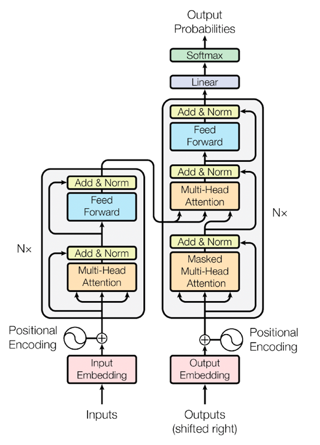

# Vectors, Embeddings, and Transformers in Large Language Models

A tutorial on understanding the mathematical foundations and practical applications of vectors in transformer-based large language models (LLMs).

## Table of Contents

1. [Introduction](#introduction)
2. [Mathematical Foundations](#mathematical-foundations)
   - [What are Vectors?](#what-are-vectors)
   - [Vector Operations](#vector-operations)
   - [Vector Spaces](#vector-spaces)
3. [Large Language Models Explained with Mathematics](#large-language-models-explained-with-mathematics)
4. [How Vectors Represent Words](#how-vectors-represent-words)
5. [Embeddings: From Words to Vectors](#embeddings-from-words-to-vectors)
6. [Transformers in Artificial Intelligence](#transformers-in-artificial-intelligence)
   - [What are Transformers?](#what-are-transformers)
   - [How Do Transformers Work?](#how-do-transformers-work)
   - [Transformer Architecture](#transformer-architecture)
7. [The Attention Mechanism](#the-attention-mechanism)
   - [Self-Attention](#self-attention)
   - [Multi-Head Attention](#multi-head-attention)
   - [What Happens Inside Attention?](#what-happens-inside-attention)
8. [Word Vectors to Word Predictions](#word-vectors-to-word-predictions)
9. [Feed-Forward Networks in Transformers](#feed-forward-networks-in-transformers)
10. [Vector Databases](#vector-databases)
    - [What is a Vector Database?](#what-is-a-vector-database)
    - [How Vector Similarity Search Works](#how-vector-similarity-search-works)
    - [Similarity Search in Vector Databases](#similarity-search-in-vector-databases)
    - [Clustering Algorithms in Vector Search](#clustering-algorithms-in-vector-search)
    - [The Role of Indexing](#the-role-of-indexing)
11. [Embeddings with Vector Databases](#embeddings-with-vector-databases)
12. [How Vector Databases Improve LLM Accuracy](#how-vector-databases-improve-llm-accuracy)
13. [How Language Models are Trained](#how-language-models-are-trained)
14. [Practical Implementation](#practical-implementation)
    - [Setup Virtual Environment](#setup-virtual-environment)
    - [Running the Scripts](#running-the-scripts)
    - [Testing the Transformer](#testing-the-transformer)
15. [Project Structure](#project-structure)
16. [References](#references)

---

## Introduction

Large language models learn by trying to predict the next word in ordinary passages of text. The neurons in the feed-forward layers and the attention heads that move contextual information between words are implemented as a chain of simple mathematical functions, mostly matrix multiplications, whose behavior is determined by adjustable weight parameters.

Each word becomes a **vector**, which is a list of real-valued coordinates within a high-dimensional space where relationships between meanings are captured by geometry. Before a model can process text, it has to convert every token (a word or fragment) into a numerical vector representing a list of floating-point values.

---

## Mathematical Foundations

### What are Vectors?

A **vector** is a mathematical object that has both magnitude and direction. In the context of LLMs, vectors are used to represent text or data in a numerical form that the model can understand and process.

Geometrically, a vector can be represented as a directed line segment, where:
- The **length** of the line indicates the magnitude
- The **arrow** points in the direction of the vector

**Mathematical Representation:**

A vector $\vec{v}$ in n-dimensional space can be written as:

$$\vec{v} = \begin{bmatrix} v_1 \\ v_2 \\ \vdots \\ v_n \end{bmatrix}$$

For example, a 3-dimensional vector:

$$\vec{v} = \begin{bmatrix} 2 \\ -1 \\ 3 \end{bmatrix}$$

### Vector Operations

#### Dot Product

The dot product (also called inner product or scalar product) of two vectors is a fundamental operation:

$$\vec{a} \cdot \vec{b} = \sum_{i=1}^{n} a_i b_i = a_1b_1 + a_2b_2 + \cdots + a_nb_n$$

For two vectors $\vec{a} = [1, 2, 3]$ and $\vec{b} = [4, 5, 6]$:

$$\vec{a} \cdot \vec{b} = (1)(4) + (2)(5) + (3)(6) = 4 + 10 + 18 = 32$$

**Properties of Dot Product:**
- If two vectors are identical, their dot product equals 1 (when normalized)
- If two vectors are orthogonal (perpendicular), their dot product equals 0
- The dot product measures similarity between vectors

#### Vector Magnitude

The magnitude (or length) of a vector is calculated as:

$$|\vec{v}| = \sqrt{v_1^2 + v_2^2 + \cdots + v_n^2}$$

#### Cosine Similarity

Cosine similarity measures the cosine of the angle between two vectors:

$$\text{similarity} = \cos(\theta) = \frac{\vec{a} \cdot \vec{b}}{|\vec{a}| \cdot |\vec{b}|}$$

This metric for determining semantic similarity in NLP:
- **Small distances** suggest high relatedness
- **Large distances** suggest low relatedness

### Vector Spaces

In LLMs, vectors exist in high-dimensional spaces. An **embedding** is a coordinate in a high-dimensional space with thousands of dimensions where mathematical proximity corresponds to semantic similarity.

**Key Properties:**
- **Dimension**: The number of components in a vector (e.g., 512, 1024, or 3072 dimensions)
- **Distance metrics**: Euclidean distance, cosine similarity, dot product
- **Semantic relationships**: Similar words are positioned close together in the vector space

---

## Large Language Models Explained with Mathematics

Large Language Models (LLMs) are foundation models that can perform a wide range of tasks based on input prompts. At their core, the FM infers the next token based on a set of input tokens. A **token** refers to any element with semantic meaning, like a word or phrase in text generation.

**Mathematical Process:**

1. **Tokenization**: Convert text into tokens
   - Input: "The sky is blue"
   - Tokens: ["The", "sky", "is", "blue"]

2. **Embedding**: Convert tokens to vectors
   $$\text{Token} \rightarrow \text{Vector} \in \mathbb{R}^d$$
   
   Where $d$ is the embedding dimension (e.g., 512 or 1024)

3. **Transformation**: Apply linear transformations (matrix multiplications)
   $$\vec{y} = W\vec{x} + \vec{b}$$
   
   Where:
   - $W$ is the weight matrix
   - $\vec{x}$ is the input vector
   - $\vec{b}$ is the bias vector
   - $\vec{y}$ is the output vector

4. **Prediction**: Generate probability distribution over vocabulary
   $$P(\text{next token} | \text{context}) = \text{softmax}(\vec{z})$$

Every linear transformation within an LLM, from attention weights to embedding updates, can be described as a matrix acting on vectors. In an embedding space, eigenvectors represent the hidden axes along which transformations scale, and eigenvalues tell us how much the transformation scales that direction.

---

## How Vectors Represent Words

Before a model can process text, it must convert every token into a numerical vector. This representation is known as **word embeddings**.

### One-Hot Encoding

The simplest representation is one-hot encoding:

For vocabulary: ["cat", "dog", "bird"]

$$\text{cat} = \begin{bmatrix} 1 \\ 0 \\ 0 \end{bmatrix}, \quad \text{dog} = \begin{bmatrix} 0 \\ 1 \\ 0 \end{bmatrix}, \quad \text{bird} = \begin{bmatrix} 0 \\ 0 \\ 1 \end{bmatrix}$$

**Limitations:**
- High dimensionality (size = vocabulary size)
- No semantic meaning (all words equally distant)
- Sparse representation

### Dense Embeddings

Modern approaches use dense, low-dimensional embeddings:

$$\text{cat} = [0.2, -0.5, 0.8, 0.1]$$
$$\text{dog} = [0.3, -0.4, 0.7, 0.2]$$
$$\text{bird} = [-0.1, 0.6, -0.3, 0.5]$$

**Advantages:**
- Lower dimensionality (typically 256-3072 dimensions)
- Captures semantic relationships
- Similar words have similar vectors

### Semantic Relationships in Vector Space

Embeddings capture semantic meaning through geometry:

$$\vec{king} - \vec{man} + \vec{woman} \approx \vec{queen}$$

This demonstrates that vector arithmetic captures conceptual relationships.

---

## Embeddings: From Words to Vectors

An **embedding** is a numerical representation (vectors in a vector space) of text. Embeddings are high-dimensional vectors that capture the semantic meaning of words.

### Creating Embeddings

**Mathematical Projection:**

Given a vocabulary of size $N$, we project each word into a lower-dimensional space of size $d$ (where $d \ll N$):

$$E: \mathbb{R}^N \rightarrow \mathbb{R}^d$$

The embedding matrix $E$ has shape $[N \times d]$:

$$E = \begin{bmatrix} 
e_{11} & e_{12} & \cdots & e_{1d} \\
e_{21} & e_{22} & \cdots & e_{2d} \\
\vdots & \vdots & \ddots & \vdots \\
e_{N1} & e_{N2} & \cdots & e_{Nd}
\end{bmatrix}$$

For a one-hot encoded word $\vec{w}$, its embedding is:

$$\vec{e} = E^T \vec{w}$$

### Properties of Embeddings

1. **Continuous Representation**: Each word is represented as a continuous vector
2. **Semantic Similarity**: Similar words have similar vectors
3. **Dimensionality Reduction**: From vocabulary size to embedding dimension
4. **Learned Representations**: Embeddings are learned during training

### Embedding Examples

**OpenAI's text-embedding-3-small**: 1,536 dimensions
**OpenAI's text-embedding-3-large**: 3,072 dimensions
**Amazon Titan Text Embedding v2**: 1,024 dimensions

---

## Transformers in Artificial Intelligence

### What are Transformers?

**Transformers** are a type of neural network architecture that transforms or changes an input sequence into an output sequence. They were introduced in the 2017 paper "Attention is All You Need" by Vaswani et al.

**Key Innovation:** Self-attention mechanism that enables the model to look at different parts of the sequence simultaneously and determine which parts are most important.

### How Do Transformers Work?

Transformers modify traditional sequential processing by incorporating a **self-attention mechanism**:

1. **Parallel Processing**: Process entire sequences simultaneously
2. **Attention Weights**: Determine importance of different sequence elements
3. **Context Understanding**: Capture long-range dependencies effectively

**Mathematical Foundation:**

The transformer processes input sequences in parallel, computing relationships between all positions:

$$\text{Attention}(Q, K, V) = \text{softmax}\left(\frac{QK^T}{\sqrt{d_k}}\right)V$$

Where:
- $Q$ = Query matrix
- $K$ = Key matrix
- $V$ = Value matrix
- $d_k$ = Dimension of key vectors

### Transformer Architecture


*Source: [AWS - What are Transformers in Artificial Intelligence?](https://aws.amazon.com/what-is/transformers-in-artificial-intelligence/)*

The transformer architecture consists of:

#### 1. Input Embeddings

Convert input tokens to vectors:

$$X = \text{Embedding}(\text{tokens})$$

Where $X \in \mathbb{R}^{n \times d_{model}}$
- $n$ = sequence length
- $d_{model}$ = embedding dimension (e.g., 512)

#### 2. Positional Encoding

Add position information to embeddings:

$$PE_{(pos, 2i)} = \sin\left(\frac{pos}{10000^{2i/d_{model}}}\right)$$

$$PE_{(pos, 2i+1)} = \cos\left(\frac{pos}{10000^{2i/d_{model}}}\right)$$

Where:
- $pos$ = position in sequence
- $i$ = dimension index

The final input is:

$$X_{input} = X + PE$$

#### 3. Transformer Blocks

A typical transformer has multiple transformer blocks stacked together. Each block contains:

**Encoder Block:**
- Multi-head self-attention mechanism
- Position-wise feed-forward network
- Layer normalization
- Residual connections

**Decoder Block:**
- Masked multi-head self-attention
- Encoder-decoder attention
- Position-wise feed-forward network
- Layer normalization
- Residual connections

#### 4. Output Layer

**Linear Transformation:**

$$Z = XW_{out} + b$$

**Softmax for Probability Distribution:**

$$P(w_i) = \frac{e^{z_i}}{\sum_{j=1}^{V} e^{z_j}}$$

Where $V$ is the vocabulary size.

---

## The Attention Mechanism

### Self-Attention

Self-attention enables the model to weigh the importance of different tokens within the sequence. It focuses on relevant parts of the input when making predictions.

**Self-Attention Computation:**

1. **Create Query, Key, and Value matrices:**

$$Q = XW_Q, \quad K = XW_K, \quad V = XW_V$$

Where $W_Q, W_K, W_V$ are learned weight matrices.

2. **Calculate attention scores:**

$$\text{Score} = QK^T$$

3. **Scale the scores:**

$$\text{ScaledScore} = \frac{QK^T}{\sqrt{d_k}}$$

Scaling prevents extremely large values that could lead to vanishing gradients.

4. **Apply softmax:**

$$\text{AttentionWeights} = \text{softmax}\left(\frac{QK^T}{\sqrt{d_k}}\right)$$

5. **Compute weighted values:**

$$\text{Output} = \text{AttentionWeights} \cdot V$$

**Complete Attention Formula:**

$$\text{Attention}(Q, K, V) = \text{softmax}\left(\frac{QK^T}{\sqrt{d_k}}\right)V$$

### Multi-Head Attention

Multi-head attention runs multiple attention mechanisms in parallel, allowing the model to focus on different aspects of the input simultaneously.

**Mathematical Formulation:**

$$\text{MultiHead}(Q, K, V) = \text{Concat}(\text{head}_1, \ldots, \text{head}_h)W^O$$

Where each head is:

$$\text{head}_i = \text{Attention}(QW_i^Q, KW_i^K, VW_i^V)$$

**Parameters:**
- $h$ = number of heads (e.g., 8)
- $d_k = d_v = d_{model}/h$ (e.g., 64 when $d_{model} = 512$)

### What Happens Inside Attention?

The attention mechanism performs several key operations:

1. **Query-Key Matching**: Computes similarity between queries and keys
2. **Scoring**: Assigns attention scores based on similarity
3. **Normalization**: Softmax converts scores to probability distribution
4. **Value Aggregation**: Weighted sum of values based on attention weights

**Example:**

Consider the sentence: "The cat sat on the mat."

When processing the word "sat", attention might assign high weights to:
- "cat" (subject performing the action)
- "mat" (location of the action)

This context helps the model understand relationships between words.

---

## Word Vectors to Word Predictions

The transformation from word vectors to predictions involves multiple stages:

### 1. Embedding Layer

$$E: \text{token} \rightarrow \mathbb{R}^{d_{model}}$$

### 2. Transformer Layers

$$H_l = \text{TransformerLayer}(H_{l-1})$$

Where each layer applies:
- Multi-head attention
- Feed-forward network
- Layer normalization
- Residual connections

### 3. Output Projection

$$Z = H_L W_{out} + b$$

Where $H_L$ is the output of the final transformer layer.

### 4. Softmax for Probabilities

$$P(w_i | \text{context}) = \frac{e^{z_i}}{\sum_{j=1}^{V} e^{z_j}}$$

### 5. Next Word Selection

The model can select the next word using:
- **Greedy decoding**: $\arg\max_i P(w_i)$
- **Beam search**: Keep top $k$ candidates
- **Sampling**: Sample from the probability distribution

---

## Feed-Forward Networks in Transformers

Each transformer block contains a position-wise feed-forward network applied to each position separately and identically.

**Architecture:**

$$\text{FFN}(x) = \max(0, xW_1 + b_1)W_2 + b_2$$

Or equivalently:

$$\text{FFN}(x) = \text{ReLU}(xW_1 + b_1)W_2 + b_2$$

**Dimensions:**
- Input dimension: $d_{model}$ (e.g., 512)
- Hidden dimension: $d_{ff}$ (e.g., 2048)
- Output dimension: $d_{model}$ (e.g., 512)

**Purpose:**
- Transforms representations learned by attention
- Introduces non-linearity through ReLU activation
- Increases model capacity

**Matrix Formulation:**

$$W_1 \in \mathbb{R}^{d_{model} \times d_{ff}}, \quad W_2 \in \mathbb{R}^{d_{ff} \times d_{model}}$$

The feed-forward network is applied to each position independently, allowing the model to think about each word vector and try to predict the next word.

---

## Vector Databases

### What is a Vector Database?

A **vector database** is a system that stores and queries vectors at scale, with efficient nearest neighbor query algorithms and appropriate indexes to improve data retrieval.

**Key Features:**
- Store high-dimensional vectors (embeddings)
- Efficient similarity search
- Scalability to billions of vectors
- Integration with metadata
- Support for various distance metrics

### How Vector Similarity Search Works

Vector similarity search finds vectors that are close to a query vector in the embedding space.

**Distance Metrics:**

1. **Euclidean Distance (L2):**

$$d(\vec{a}, \vec{b}) = \sqrt{\sum_{i=1}^{n}(a_i - b_i)^2}$$

2. **Cosine Similarity:**

$$\text{similarity}(\vec{a}, \vec{b}) = \frac{\vec{a} \cdot \vec{b}}{|\vec{a}| \cdot |\vec{b}|}$$

3. **Dot Product:**

$$\text{score}(\vec{a}, \vec{b}) = \sum_{i=1}^{n} a_i b_i$$

**Process:**

1. Convert query text to embedding vector
2. Search for k-nearest neighbors in vector database
3. Return most similar documents/chunks
4. Use retrieved context to augment LLM prompt

### Similarity Search in Vector Databases

**Exact Search:**

Compute distance to all vectors in database:

$$\text{results} = \text{top-k}\{d(\vec{q}, \vec{v}_i) : \vec{v}_i \in D\}$$

Where $D$ is the database of vectors.

**Approximate Search (ANN):**

Use indexing structures for faster search:
- **HNSW** (Hierarchical Navigable Small World)
- **IVF** (Inverted File Index)
- **Product Quantization**

Trade-off: Speed vs. Accuracy

### Clustering Algorithms in Vector Search

**K-Means Clustering:**

Partition vectors into $k$ clusters:

$$\arg\min_C \sum_{i=1}^{k} \sum_{\vec{x} \in C_i} |\vec{x} - \mu_i|^2$$

Where $\mu_i$ is the centroid of cluster $C_i$.

**HDBSCAN:**

Hierarchical density-based clustering that can identify clusters of varying densities.

**Applications:**
- Organize similar documents
- Create topic clusters
- Improve search efficiency
- Discover patterns in data

### The Role of Indexing

Indexing for efficient vector search at scale.

**Index Types:**

1. **HNSW (Hierarchical Navigable Small World)**
   - Graph-based index
   - High accuracy and speed
   - Good for high-dimensional data

2. **IVFFlat (Inverted File Flat)**
   - Partitions vectors into clusters
   - Faster search with slight accuracy trade-off
   - Efficient for large datasets

3. **Product Quantization**
   - Compresses vectors
   - Reduces memory usage
   - Balances speed and accuracy

**Index Creation:**

$$\text{Index}: D \rightarrow \text{SearchStructure}$$

Where $D$ is the set of vectors.

---

## Embeddings with Vector Databases

### Integration Process

1. **Generate Embeddings:**

$$\vec{e} = \text{EmbeddingModel}(\text{text})$$

2. **Store in Vector Database:**

```
INSERT INTO vectors (id, embedding, metadata)
VALUES (1, [0.1, 0.2, ...], {'content': 'text', 'source': 'doc1'})
```

3. **Query for Similar Vectors:**

```
SELECT id, metadata, distance
FROM vectors
ORDER BY embedding <-> query_vector
LIMIT k
```

### Retrieval Augmented Generation (RAG)

RAG improves LLM responses by retrieving relevant context:

**Process:**

1. **User Query**: "What is the capital of France?"
2. **Generate Query Embedding**: $\vec{q} = \text{Embed}(\text{query})$
3. **Search Vector Database**: Find top-k similar documents
4. **Augment Prompt**: Combine query + retrieved context
5. **Generate Response**: LLM produces answer grounded in context

**Mathematical Flow:**

$$\text{context} = \text{VectorDB.search}(\vec{q}, k)$$
$$\text{prompt} = \text{query} + \text{context}$$
$$\text{response} = \text{LLM}(\text{prompt})$$

---

## How Vector Databases Improve LLM Accuracy

Vector databases enhance LLM performance in several ways:

### 1. Domain-Specific Knowledge

**Problem**: LLMs have a knowledge cutoff date

**Solution**: Store up-to-date information in vector database

$$P(\text{correct response}) = P(\text{LLM capable}) \times P(\text{has context})$$

### 2. Reduce Hallucinations

Hallucinations occur when the model generates plausible but incorrect information.

**Mitigation Strategy:**
- Ground responses in retrieved facts
- Verify against source documents
- Provide citations

### 3. Contextual Relevance

**Semantic Search Formula:**

$$\text{relevance}(\text{query}, \text{doc}) = \frac{\vec{q} \cdot \vec{d}}{|\vec{q}| \cdot |\vec{d}|}$$

Higher values indicate more relevant documents.

### 4. Cost Efficiency

**Benefits:**
- Smaller context windows needed
- Reduced token usage
- Faster inference times

---

## How Language Models are Trained

### Training Process

Language models are trained to predict the next token in a sequence.

**Objective Function:**

$$\mathcal{L} = -\sum_{t=1}^{T} \log P(w_t | w_1, \ldots, w_{t-1}; \theta)$$

Where:
- $w_t$ = token at position $t$
- $\theta$ = model parameters
- $T$ = sequence length

### Forward Pass

1. **Input Processing:**

$$X = \text{Embedding}(\text{tokens}) + \text{PositionalEncoding}$$

2. **Transformer Layers:**

For each layer $l$:

$$H_l = \text{LayerNorm}(H_{l-1} + \text{MultiHeadAttention}(H_{l-1}))$$
$$H_l = \text{LayerNorm}(H_l + \text{FeedForward}(H_l))$$

3. **Output Projection:**

$$\text{logits} = H_L W_{out}$$

4. **Probability Distribution:**

$$P(w_i) = \text{softmax}(\text{logits})_i$$

### Backward Pass

Compute gradients using backpropagation:

$$\frac{\partial \mathcal{L}}{\partial \theta} = \frac{\partial \mathcal{L}}{\partial \text{logits}} \cdot \frac{\partial \text{logits}}{\partial \theta}$$

Update parameters:

$$\theta_{new} = \theta_{old} - \eta \frac{\partial \mathcal{L}}{\partial \theta}$$

Where $\eta$ is the learning rate.

### Training Data

Models are trained on massive text corpora:
- Web pages
- Books
- Articles
- Code repositories

**Scale:**
- GPT-3: 175 billion parameters
- Training tokens: Hundreds of billions

---

## Practical Implementation

### Setup Virtual Environment

#### Prerequisites

- Python 3.8 or higher
- pip package manager
- Virtual environment support

#### Linux (VS Code)

1. **Create Virtual Environment:**

```bash
python3 -m venv venv
```

2. **Activate Virtual Environment:**

```bash
source venv/bin/activate
```

3. **Verify Activation:**

You should see `(venv)` in your terminal prompt.

4. **Install Dependencies:**

```bash
pip install --upgrade pip
pip install torch torchvision torchaudio
pip install transformers
pip install numpy
pip install matplotlib
```

5. **Deactivate (when done):**

```bash
deactivate
```

### Running the Scripts

The project includes Python scripts demonstrating attention mechanisms and transformer models.

#### Basic Attention Script

**File**: `src/attention_demo.py`

```bash
# Ensure virtual environment is active
source venv/bin/activate

# Run the script
python src/attention_demo.py
```

#### Question Answering Demo

**File**: `src/qa_demo.py`

```bash
# Ensure virtual environment is active
source venv/bin/activate

# Run the Q&A demo
python src/qa_demo.py
```

**Expected Output:**

```
Question: What is the capital of France?
Answer: Paris
```

### Testing the Transformer

#### Simple Transformer Test

Create a test script to verify the transformer implementation:

```python
import torch
from transformers import AutoTokenizer, AutoModelForCausalLM

# Load pre-trained model
model_name = "gpt2"
tokenizer = AutoTokenizer.from_pretrained(model_name)
model = AutoModelForCausalLM.from_pretrained(model_name)

# Test input
text = "What is the capital of France?"
inputs = tokenizer(text, return_tensors="pt")

# Generate response
outputs = model.generate(**inputs, max_length=50)
response = tokenizer.decode(outputs[0], skip_special_tokens=True)

print(f"Input: {text}")
print(f"Response: {response}")
```

#### Attention Visualization

View how attention heads focus on different words:

```python
import torch
import matplotlib.pyplot as plt
from transformers import AutoTokenizer, AutoModel

# Load model
tokenizer = AutoTokenizer.from_pretrained("bert-base-uncased")
model = AutoModel.from_pretrained("bert-base-uncased", output_attentions=True)

# Tokenize input
text = "The cat sat on the mat"
inputs = tokenizer(text, return_tensors="pt")

# Get attention weights
outputs = model(**inputs)
attentions = outputs.attentions

# Visualize attention for first head of first layer
attention = attentions[0][0, 0].detach().numpy()
tokens = tokenizer.convert_ids_to_tokens(inputs['input_ids'][0])

plt.figure(figsize=(10, 8))
plt.imshow(attention, cmap='viridis')
plt.xticks(range(len(tokens)), tokens, rotation=90)
plt.yticks(range(len(tokens)), tokens)
plt.colorbar()
plt.title("Attention Weights Visualization")
plt.tight_layout()
plt.savefig("attention_visualization.png")
print("Attention visualization saved to attention_visualization.png")
```

---

## Project Structure

```
Vectors/
├── README.md                 # This file
├── transformer.png           # Transformer architecture diagram
├── .gitignore               # Git ignore file
├── requirements.txt         # Python dependencies
├── venv/                    # Virtual environment (excluded from git)
├── src/                     # Source code
│   ├── __init__.py
│   ├── attention_demo.py    # Attention mechanism demonstration
│   ├── qa_demo.py          # Question answering demo
│   ├── embeddings.py       # Embedding utilities
│   └── transformer.py      # Transformer implementation
├── notebooks/              # Jupyter notebooks
│   ├── attention_exploration.ipynb
│   └── vector_similarity.ipynb
├── data/                   # Sample data
│   └── sample_text.txt
└── tests/                  # Unit tests
    ├── test_attention.py
    └── test_embeddings.py
```

---

## References

### Papers and Documentation

1. **Attention Is All You Need** (Original Transformer Paper)
   - Vaswani, A., et al. (2017)
   - https://proceedings.neurips.cc/paper/2017/file/3f5ee243547dee91fbd053c1c4a845aa-Paper.pdf

2. **Transformers from Scratch**
   - Brandon Rohrer
   - https://brandonrohrer.com/transformers.html

3. **How Transformers Work: A Detailed Exploration**
   - DataCamp Tutorial
   - https://www.datacamp.com/tutorial/how-transformers-work

4. **Transformers-based Encoder-Decoder Models**
   - Hugging Face Blog
   - https://huggingface.co/blog/encoder-decoder

5. **The Transformer Architecture**
   - Dive into Deep Learning (d2l.ai)
   - https://d2l.ai/chapter_attention-mechanisms-and-transformers/transformer.html

### AWS and Cloud Resources

6. **What are Transformers in Artificial Intelligence?**
   - AWS Documentation
   - https://aws.amazon.com/what-is/transformers-in-artificial-intelligence/

7. **The Role of Vector Databases in Generative AI Applications**
   - AWS Database Blog
   - https://aws.amazon.com/blogs/database/the-role-of-vector-datastores-in-generative-ai-applications/

### OpenAI and Embeddings

8. **Vector Embeddings**
   - OpenAI API Documentation
   - https://developers.openai.com/api/docs/guides/embeddings

9. **Get Text Embeddings**
   - Google Cloud Vertex AI
   - https://docs.cloud.google.com/vertex-ai/generative-ai/docs/embeddings/get-text-embeddings

### Practical Guides

10. **Neural Machine Translation with a Transformer and Keras**
    - TensorFlow Tutorial
    - https://www.tensorflow.org/text/tutorials/transformer

11. **From Prompts to Embeddings and Vector Stores**
    - Microsoft Tech Community
    - https://techcommunity.microsoft.com/blog/startupsatmicrosoftblog/from-prompts-to-embeddings-and-vector-stores---how-to-use-openai-in-real-life-sc/3887755

12. **How to Create Embeddings and Store Them in Vector Stores**
    - Azure Data and AI Examples
    - https://github.com/denisa-ms/azure-data-and-ai-examples/tree/master/openai

### Vector Databases and RAG

13. **A LangChain Vector Store from Scratch**
    - https://kleiber.me/blog/2024/08/04/demystifying-vector-stores-lanchain-vector-store-from-scratch/

14. **Do We Still Need Vector Retrieval?**
    - Weights & Biases Blog
    - https://wandb.ai/byyoung3/rag-eval/reports/RAG-vs-prompt-stuffing-Do-we-still-need-vector-retrieval---VmlldzoxMzE5Mjk0NA

15. **How Vector Databases Boost LLM Accuracy**
    - https://prompts.ai/blog/how-vector-databases-boost-llm-accuracy.html

### Research and Interpretability

16. **Tracing the Thoughts of a Large Language Model**
    - Anthropic Research
    - https://www.anthropic.com/research/tracing-thoughts-language-model

17. **Vertex AI Embeddings for Text: Grounding LLMs**
    - Google Cloud Blog
    - https://cloud.google.com/blog/products/ai-machine-learning/how-to-use-grounding-for-your-llms-with-text-embeddings

18. **What is Prompt Engineering?**
    - Google Cloud
    - https://cloud.google.com/discover/what-is-prompt-engineering

### Additional Resources

19. **Transformer Architecture Self-Attention Mechanism**
    - Codecademy
    - https://www.codecademy.com/article/transformer-architecture-self-attention-mechanism

20. **The Annotated Transformer**
    - Harvard NLP
    - Implementation guide with detailed explanations

---

## License

All referenced papers and resources belong to their respective authors and organizations.

---

**Last Updated**: April 2026

